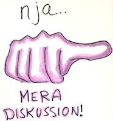
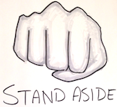
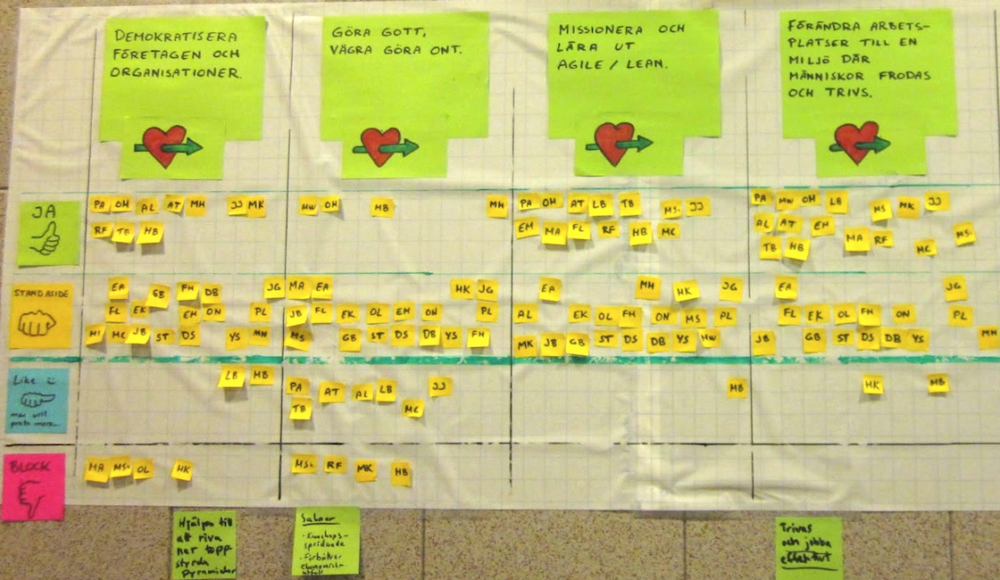
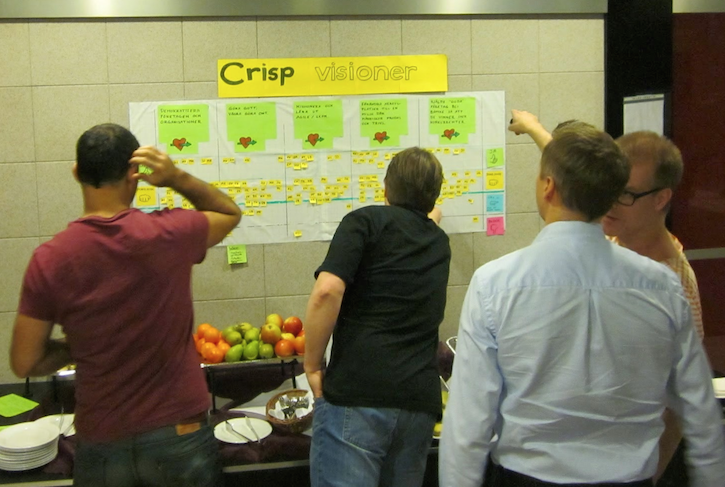

# Hand signals

Hand signals are an essential part of our
[communication](communication.html) and
[decision-making](decisions.html) system, especially for important
decisions that affect many people.

Think about it. If 25 people are sitting in a big circle, and one person
wants to find out how the others feel about a proposal, what’s fastest?
Asking everyone to speak up? Asking everyone to write on sticky-notes or
fill in a survey? Those ways are fine if you want details. But if you
just want a quick temperature check, or test for agreement, then hand
signals are superior! Because it takes just 10 seconds for everyone to
hold up a hand signal and see what everyone else thinks.

## Decision-making signals

Here are the main hand signals we use when [making
decisions](decisions.html) in a big group (or testing for agreement on
something):

### Thumb up = Yes! I actively support this.

### Thumb sideways = More discussion needed, I’m missing info.

This doesn’t mean I disagree, it just means that I need clarification.

### Thumb down = No! I block this. But I’m willing to discuss.

This means I understand the proposal, but I don’t support it. Obviously
I need to be willing to explain why. Sometimes the No is pretty
definite, other times a minor tweak can turn the No into a Yes. Either
way, further discussion is needed before we can decide.

### Fist forward = I stand aside. I don’t need to be involved. Do whatever you want.

Not all decisions affect everyone, so the fist-forward signal
essentially gives the rest of the group permission to decide without me.

> In the past we used to have just 3 signals: thumb-up, thumb-sideways,
> thumb-down. It worked, but we realized that thumb-sideways was a bit
> ambiguous. We introduced the fist-forward signal too visually
> distinguish between “I need more info” vs “I don’t care about this”.
> The thumb-sideways people need to be heard, the fist-forward people
> don’t. For the full story behind this shift, see the blog post [Crisp
> consensus model
> 2.1](http://blog.crisp.se/2014/03/27/peterantman/crisp-consensus-model-2-1).

## Discussion signals

Discussion signals aren’t needed for small group discussions (like six
or less), but they are REALLY useful when we have 25 people sitting in a
circle arguing about a pending decision or new idea!

### One hand up = I want to speak (put me in line)

If you have something to say, and someone else is already speaking, and
others seem to want to talk too, then put your hand up and wait your
turn.

### Two hands up = I have an important fact (let me me speak ASAP!)

Sometimes you have a short concise piece of information that everyone
should take into account before continuing the conversation (or making
the decision). Yet you don’t want to interrupt the current speaker. In
that case two hands up puts you first in the speaking queue.

### Circling finger = +1 (I agree with what I’m hearing right now)

The circling finger is a silent way of saying “Amen bro I’m right
wit’cha on dat!”

Feels pretty good to see a bunch of circling fingers as you present your
opinion on something (as opposed to arms crossed and frowning…)!

## How a big-group decision is made using hand signals

For big-group settings (like our [unconference](unconference.html)) a
facilitator is usually needed to support the decision making process.
The details will vary, but here’s a typical scenario for an important
decision that will affect many people:

1.  Someone (the decision “driver”) brings up a concrete proposal
    (usually coming out of an open-space session)
2.  A first voting round is made using the decision signals.
3.  If all thumbs are up, the decision is made! Some may stand aside,
    because they aren’t affected. That’s fine.
4.  If there is lots of disagreement the decision is usually postponed.
    The driver has more work to do before the decision can be made.
5.  Otherwise any people with thumb sideways are heard. If necessary,
    the proposal is adjusted based on the information or questions that
    came up.
6.  Any blocker (thumb down) is checked if still blocking. Normally a
    block takes too long to resolve in a big circle. The blocker(s) and
    the driver are asked to make this an open-space topic (or similar).
7.  The proposal is discussed in smaller circles.
8.  The proposal is updated and taken up again for decision. Similar
    procedure as above.

Big decisions sometimes require several iterations, but it’s usually
worth it. Not only do we get a better decision, we get stronger buy-in.

See [How we make decisions](decisions.html) for more info on this.

## Using hand signals without hands

The hand signals can be useful without actual hands too! For example we
used a multi-voting technique to decide on our [visions](visions.html):

Each column was a proposed vision statement, with all names underneath
on sticky-notes. People could move their names up and down into the
different hand-signal boxes to show how they feel about each vision
statement.

The people in the “No” boxes were asked to explain their objection - do
they dislike the vision itself, or just how it is phrased? The people in
the “Discuss” were invited to ask questions for clarification.

We used the input to continuously tweak the vision statements, and by
the end of the conference we had [two vision statements](visions.html)
with 100% consensus (= no thumb down or thumb sideways). That felt extra
important in this case, because we’d rather have no vision at all than
to have one with weak buy-in.

Remember - consensus doesn’t mean everyone agrees! It just means
everyone who is affected understands and will support the decision.
